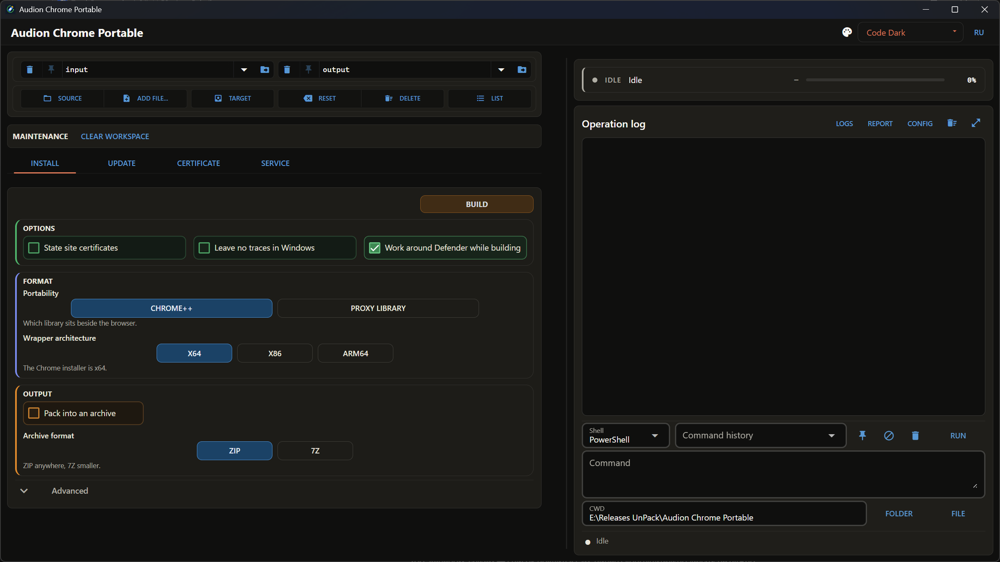

# Audion Chrome Portable

<!-- audion:release -->
[](https://audion.dev/downloads/chrome-portable) [](https://github.com/Tensionix/chrome-portable/releases/latest) [](https://github.com/Tensionix/chrome-portable/releases) [](https://github.com/Tensionix/chrome-portable/blob/main/LICENSE)

**Version 1.0.0** · 2026-08-25 · 81.6 MB

- [Direct download](https://audion.dev/get/chrome-portable/1.0.0/Audion_Chrome_Portable_v1.0.0_Full.zip) — unmetered, no rate limits
- [Project page](https://audion.dev/downloads/chrome-portable) — every version and how to install



`SHA-256: 74eafd54024b49891dc7c1083b798cd626644ad9c9d38e467ae69b5aa160e627`

---

An **Audion** tool, published by [Tensionix](https://github.com/Tensionix).
<!-- /audion:release -->

Builds a portable Google Chrome, updates a build it is given, keeps Chrome++
current, and can place the Russian Trusted CA certificates into the build along
with two wrappers — install and uninstall. Nothing is installed into Windows: the
standalone installer is unpacked rather than run.

## How it works

```text
ChromeStandaloneSetup64.exe (~120 MB)
└── Chrome.7z
    └── Chrome-bin\        →  <build>\App\
          chrome.exe
          <version>\ and the rest
```

Google moves `Chrome.7z` around inside the installer from time to time, so the
program does not trust a fixed path: it walks the candidates and probes them
until the payload turns up.

Chrome++ provides the portability: its `version.dll` goes beside `chrome.exe`.
The running process then carries `--portable` and `--user-data-dir`, the profile
lands in `Data` beside `App` and the cache in `Cache`. An installed Chrome is
unaffected — verified on a machine where one was running at the same time.

The wrapper is a choice: Chrome++, the proxy library
([neyrostalker/proksi-biblioteka](https://gitflic.ru/project/neyrostalker/proksi-biblioteka)
on GitFlic, pulled off the public pages without a token). The proxy library blocks registry writes instead of wiping the branch
on exit and draws no complaint from Microsoft; it ships x86 and x64 only. The
three engines and the VirusTotal check are covered in
`docs/CHROME_PLUS_AND_DEFENDER.md`.

Chrome++ is a long-standing, respected open-source project; antivirus sometimes
mistakes its `version.dll` for a threat. Why that is a false positive and how the
program works around it during a build — see
[CHROME_PLUS_AND_DEFENDER.md](CHROME_PLUS_AND_DEFENDER.md).

A finished build:

```text
Google Chrome Portable\
  App\                          browser, version.dll, chrome++.ini
  Data\                         profile
  Cache\                        cache
  Certificates\                 the certificates and their two wrappers
  Google Chrome Portable.cmd    launcher
  Portable-Build.json           which versions are inside
```

## The interface

The root window is a switcher of four tabs. A command with parameters unfolds on
the tab itself: its own run button, named after the action, and its own fields.
Service operations sit in a strip above the tabs. Choices are buttons — the
chosen one washed with translucent blue, the rest outlined. Captions are short;
the explanation lives in the tooltip.

## Commands

| Tab | Command | What it does |
| --- | --- | --- |
| `Install` | `Build` | Downloads the installer and Chrome++, publishes a build into the Target folder. |
| `Update` | `Check` | Compares the published versions with the build. Downloads nothing. |
| `Update` | `Update` | Replaces `App` in the build Source points at, keeps `Data` and `Cache`. |
| `Update` | `Chrome++` | Replaces `version.dll` and `chrome++.ini`, leaves the browser alone. |
| `Certificate` | `Check` | Reports whether the user trusts them. Changes nothing. |
| `Certificate` | `Into the build` | Places both files and the wrappers into the build. Adds no trust. |
| `Certificate` | `Install` | Adds them to the current user's stores. |
| `Certificate` | `Revoke` | Removes exactly those two, by fingerprint. |
| `Service` | `7-Zip` | Checks the unpacker and puts a portable copy into the project folder. |

## Updating

The published Chrome version comes from Google's version history API, so a check
costs one small request and never the installer. The build's own version is read
out of the folder (`FileVersion` of `chrome.exe` and of `version.dll`), so a build
assembled elsewhere can be updated too.

The update happens **in place**: the build is refreshed in the folder Source
points at rather than published anew into the Target folder, which is there for
new builds. With nothing in Source, the program looks in `output\Portable`. `App`
is swapped by renaming — the old folder steps aside, the new one takes its place,
and only then is the old one deleted. When the browser is running and the rename
fails, the operation says so and leaves the build alone.

Chrome++ is refreshed together with the browser and by its own command. The asset
list comes from the GitHub API and, on any error from it, off the
`releases/latest` and `releases/expanded_assets/<tag>` pages, where there is no
quota: 60 anonymous API calls an hour run out quietly.

## The certificate block

Chrome on Windows consults the **current user's** certificate stores alongside
its own root store. So the certificates are added with

```bat
certutil -addstore -user -f Root russian_trusted_root_ca.crt
certutil -addstore -user -f CA  russian_trusted_sub_ca.crt
```

No administrator rights, no effect on other accounts, and it is taken back by
thumbprint. Both operations re-read the store afterwards rather than trusting an
exit code.

The thumbprints are fixed in the program:

- `Russian Trusted Root CA` — `8FF915CC…AEC2F`, store `Root`;
- `Russian Trusted Sub CA` — `335D43F5…8A01`, store `CA` (intermediate).

An honest caveat: a certificate cannot live entirely "inside the folder" — Chrome
on Windows reads the system stores, not a file beside itself. That is why
trusting one is a separate, reversible step rather than part of the build.

Yandex Browser does not need this: it trusts that CA out of the box. It has its
own program — Audion Yandex Portable.

## What it leaves in the system

Chrome keeps counters in `HKCU\Software\Google\Chrome`. The build can wipe that
branch on exit, but does **not** by default: the branch is shared with an
installed Chrome, and most machines have one. Turn the checkbox on only where
there is no installed Chrome.

## Requirements

- Windows, the portable Python in `runtime\` (ships with the project).
- `tools\7zip\bin\7za.exe` — installed by the `7-Zip` command on the `Service` tab.
- About 120 MB of download and up to 700 MB while unpacking and publishing.

## Running

```bat
launcher_gui.cmd
```
